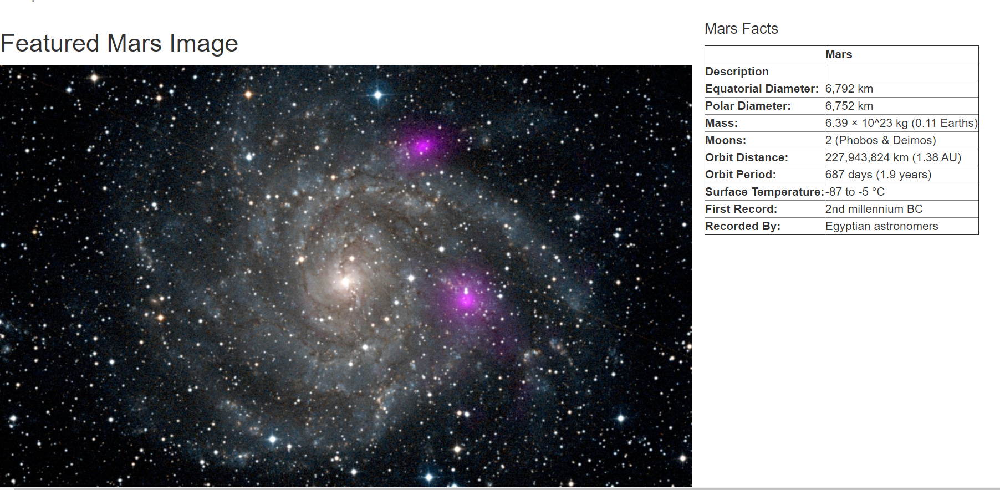
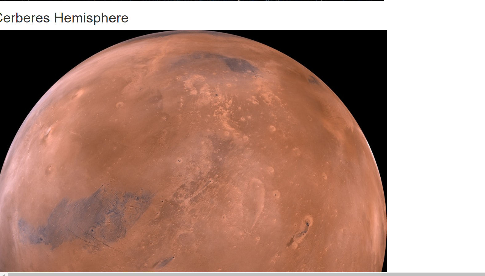
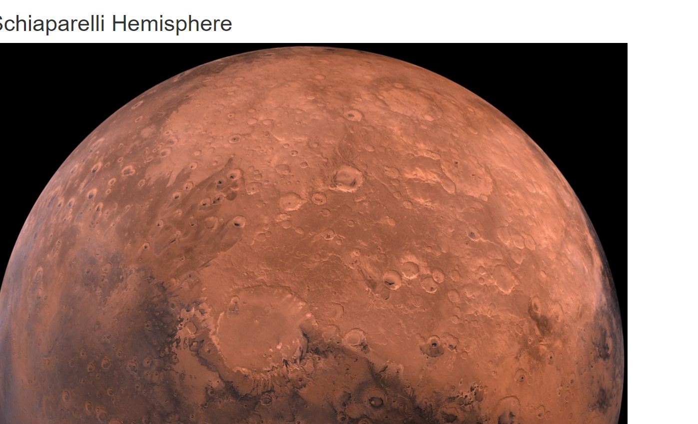
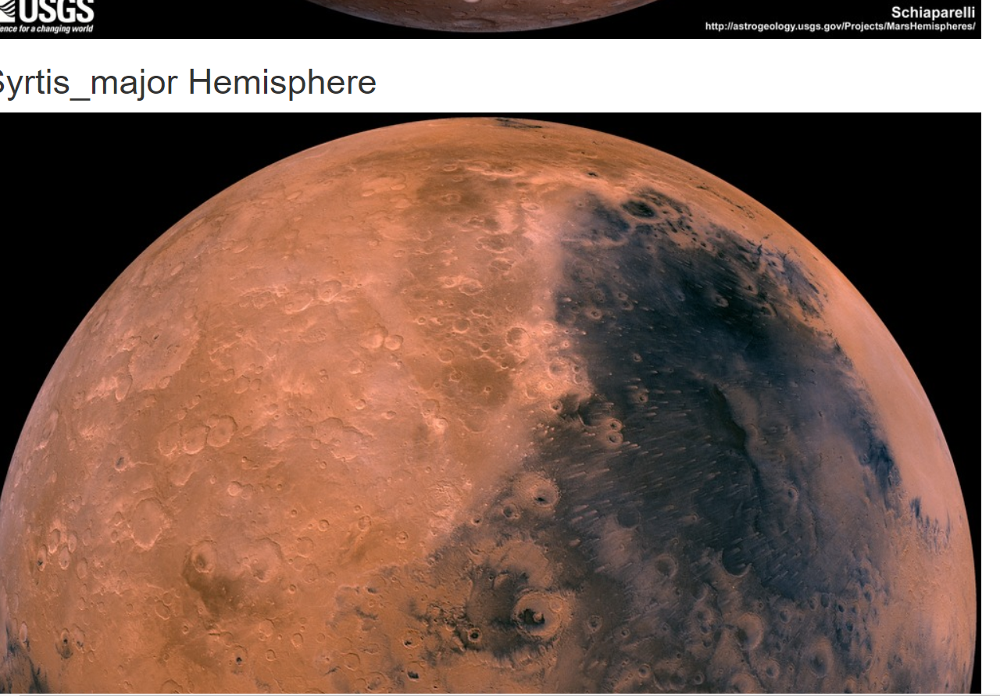

# MissionToMars
Web Scraping Project
This project contains an app that will scrape several websites and bring back images and data about Mars. The data is scraped, stored in a Mongo database and presented on a webpage using HTML.

## Resources
The data is scraped from these websites.
- https://mars.nasa.gov/news/
- https://www.jpl.nasa.gov/spaceimages/?search=&category=Mars
- http://space-facts.com/mars/
- https://astrogeology.usgs.gov/search/results?q=hemisphere+enhanced&k1=target&v1=Mars

## Screenshots from the Mars Portfolio

## Software:

- Pyton 3.7.6
- Jupyter Notebook 6.0.3
- BeautifulSoup
- MongoDB
- Flask
- Splinter
- ChromeDriver
- Pandas 1.0.1
- VS Code

